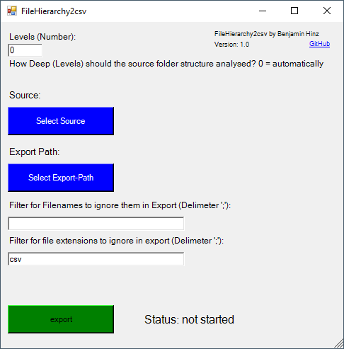

# PowerShell Script Documentation: File Hierarchy Export as CSV

## Overview
This PowerShell script, `FileHierarchy2csv`, is designed to export the file and directory structure of a given source folder into a CSV file. It includes options to limit the directory levels to export and apply filters to ignore certain file names and extensions. The script can be run with or without a GUI, and the GUI provides an easy interface for users to configure the parameters.

### Author
- **Name:** Benjamin Hinz
- **Date:** September 22, 2024
- **Version:** 1.0
- **GitHub Repository:** [Hin7zer GitHub](https://github.com/Hin7zer)

---

## Demonstration example

The following Picture shows the visual overview of the script.



The following Table is an Example of the export 

| FileName           | FileExtension | Level1     | Level2        | Level3        |
|--------------------|---------------|------------|---------------|---------------|
| TestRecord1        | wav           | Music      | MyMusic       | -             |
| Remix2012          | mp3           | Music      | MyMusic       | -             |
| track1             | mp3           | Music      | Snoop Dogg    | album1        |
| track2             | mp3           | Music      | Snoop Dogg    | album1        |
| track1             | mp3           | Music      | Snoop Dogg    | album2        |
| track2             | mp3           | Music      | Snoop Dogg    | album2        |
| Software1          | pdf           | Documents  | Bills         | -             |
| Software2          | pdf           | Documents  | Bills         | -             |
| FileHierarchy2csv  | md            | Documents  | Documentation | -             |


## Features
- **Export directory structure**: Exports all files from a specified directory into a CSV format.
- **GUI and CLI Support**: Can be used with or without a graphical user interface (GUI).
- **File and Extension Filters**: Allows filtering by file names and extensions using a delimiter-separated list.
- **Recursive Levels**: Limit the depth of directory levels to be exported or analyze the full depth. Each directory name will be exported in the level field.
- **Log System**: Logs actions and warnings both in the console and to an optional log file and gui messages.

---

## Parameters

Some Parameters are required on execution.

The script can be customized using the following parameters:

| Parameter              | Type     | Default Value         | Description                                                                          |
|------------------------|----------|-----------------------|--------------------------------------------------------------------------------------|
| `-nogui`               | Switch   | `false`               | Runs the script without GUI if set.                                                  |
| `-sourcePath`          | String   | N/A                   | Path of the source folder to be exported.                                            |
| `-exportFile`          | String   | N/A                   | File path where the CSV output should be saved.                                      |
| `-ignore_FileNames`    | String   | `""` (Empty)          | Delimiter-separated `;` list of file names to ignore.                                    |
| `-ignore_FileExtensions` | String   | `"csv"`              | Delimiter-separated list of file extensions to ignore (e.g., `"txt;doc"`).           |
| `-levels`              | Integer  | `0` (Unlimited)       | Limits the depth of recursion when exporting directory structure.                    |

---

## Key Functions

### 1. **`log_message`**
Handles logging to both console and file. It supports different log levels (INFO, WARNING, etc.) and can also show messages in a dialog box in the GUI mode.

#### Parameters:
- `log_message`: The message to log.
- `log_level`: Log severity (INFO, WARNING, etc.).
- `log_file`: Path to a log file (optional).
- `log_gui`: If `true`, displays the log message in a message box (GUI).
- `log_status`: If `true`, the log will be written to a file.

### 2. **`export_structure`**
The core function that handles file export. It recursively scans the source directory and writes the directory structure and file details to the specified CSV file, applying the filters for ignored file names and extensions.

#### Parameters:
- `sourcePath`: Path of the source folder to be exported.
- `exportFile`: Destination CSV file path.
- `ignore_FileNames`: List of file names to ignore.
- `ignore_FileExtensions`: List of file extensions to ignore.

### 3. **`IntegerCheck`**
Ensures the user input for the `levels` parameter is a valid integer. Logs a warning if not.

#### Parameters:
- `intvarcheck`: The input value to check.

### 4. **`load_gui`**
Builds and displays the graphical user interface. The GUI allows users to select a source folder and export path, configure filters, and initiate the export process.

### GUI Components:
- Text boxes for source path, export path, levels, file name filters, and extension filters.
- Buttons for source and export path selection.
- Labels for various settings and statuses.
- A status display showing the current state of the script (e.g., running, completed).

### 5. **`main`**
The entry point function that decides whether to run the script in GUI or command-line mode based on the `nogui` switch. If running in non-GUI mode, it verifies necessary parameters and calls `export_structure`. In GUI mode, it launches the form using `load_gui`.

---

## Usage Examples

### 1. Running Without GUI
If you want to run the script in a non-GUI mode, simply use the `-nogui` switch and provide the necessary parameters like source path and export file.

```bash
powershell.exe -File FileHierarchy2csv.ps1 -nogui -sourcePath "C:\MySource" -exportFile "C:\export.csv" -ignore_FileExtensions "csv;tmp"
```

### 2. Running With GUI
If you omit the `-nogui` switch, the script will run with the graphical user interface:

```bash
powershell.exe -File FileHierarchy2csv.ps1
```

The GUI will prompt you to select the source folder, export file path, levels, and filters.

A Double Click on this script should also start the script. Keep in mind it may be neccessary to enable Powershell scripts on your device.

---

## Log File
Logs are saved in a file named `FileHierarchy2csv.log.txt` by default, located in the current working directory. Log entries include timestamps, log levels, and detailed information about the script's execution.

---

## Notes
- **Levels Parameter**: If `levels` is set to `0`, the script automatically determines the depth of recursion based on the deepest subfolder in the source path.
- **Filters**: The script allows file names and extensions to be ignored during the export process. These filters are specified as semicolon-separated lists.

---

## Dependencies
- **.NET Assemblies for GUI**: 
    - `System.Windows.Forms`
    - `System.Drawing`
    - `PresentationCore`
    - `PresentationFramework`

These are required if the script is run with the GUI. The dependencies should be loaded automatically because the script uses powershell default modules

---

## Troubleshooting

- If the source or export paths are not provided in non-GUI mode, the script will terminate with a warning.
- Ensure that the `levels` parameter is a valid integer. If not, a warning will be logged and the process will not start.
